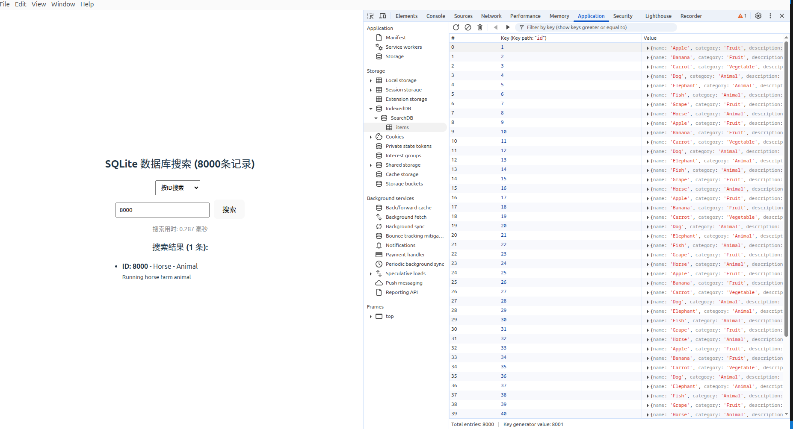

# 前言
使用AI生成了代码测试了两种方案下的8000条数据的查询时间，一个是存在前端里的indexdb里，一个是存在后端的sqlite3里然后通过ipc查询。

结果是ipc+better-sqlite3快多了，用时0.1-0.3毫秒，而indexdb用时大概2毫秒。查询都是基于id查询的，都有索引。

# Electron的版本冲突问题
我遇到了better-sqlite3的`NODE_MODULE_VERSION`和Electron的版本不匹配的问题，导致无法加载模块。解决方法是使用`electron-rebuild`重新编译模块。又因为我是直接下载的electron安装包，不是用npm导入的，所以这个命令查不到我的electron版本，不过直接指定electron版本来解决问题。
