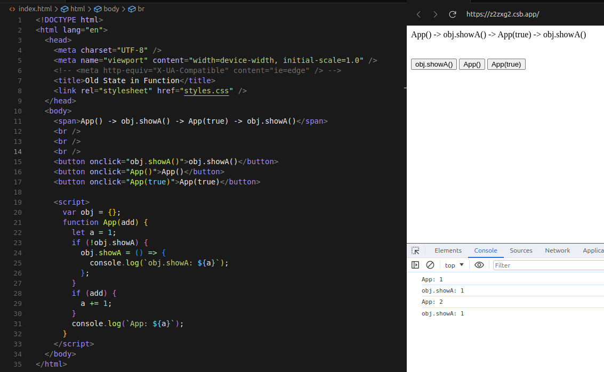

import TimerAndOldStateDemo from '@site/src/components/React/TimerAndOldStateDemo';

# 前言
遇到了一个闭包带来的bug,涉及到作用域。感觉还是挺常见的，在这里探讨一下。
我在useEffect里绑定里点击事件函数，这个函数里用到了state的值，然后我发现每次执行点击事件的回调函数，这个值都是绑定时的state值。


## 点击事件的回调函数的闭包问题

我把问题简化为这样：
<iframe src="https://codesandbox.io/embed/z2zxg2?view=editor+%2B+preview&hidenavigation=1&expanddevtools=1"
  style={{width: '100%', height: '500px', border: 0, borderRadius: 4, overflow: 'hidden'}}
  title="AutoFixScreen"
  allow="accelerometer; ambient-light-sensor; camera; encrypted-media; geolocation; gyroscope; hid; microphone; midi; payment; usb; vr; xr-spatial-tracking"
  sandbox="allow-forms allow-modals allow-popups allow-presentation allow-same-origin allow-scripts"
></iframe>

依次点击按钮后，结果如下：全局变量obj里的showA函数打印的是旧的值


闭包的特性让obj.showA在定义时捕获到第一次执行App函数创建的作用域里的a,此后showA函数里的a就一直是该作用域里的a。

解决办法就是重新定义obj.showA, 所以react组件里每次state变化->组件函数重新渲染，也就是再次执行组件函数->重新定义了事件点击函数->点击事件函数用了新的state值。
这符合我们常规的写法。

但是我们不想每次重新渲染都要进行申请内存来重新定义函数，比如我定义了鼠标事件，每次缩放或者移动都重新画canvas,这个操作很频繁，所以我不想频繁定义鼠标事件的回调函数。
所以我希望在组件创建时绑定事件的回调函数，我的做法是声明一个状态表示鼠标事件触发了，然后把这个状态加入重画canvas的函数的useEffect依赖里。


## SetTimeout闭包问题演示

<TimerAndOldStateDemo />

简化后的代码如下：

```
useEffect(() => {
  if(flag) {
    setTimeout(() => {
      alert(`当前count值是: ${count}`);
    }, 2000)
  }
}, [flag])

<button onClick={() => setFlag(flag+1)} >
```
useEffect函数声明的时候传入的匿名函数里的count值是当时的值，setTimeout的回调函数形成闭包，捕获了这个count值，所以无论flag怎么变化，setTimeout回调函数里alert显示的count值都是上次点击时的count值。